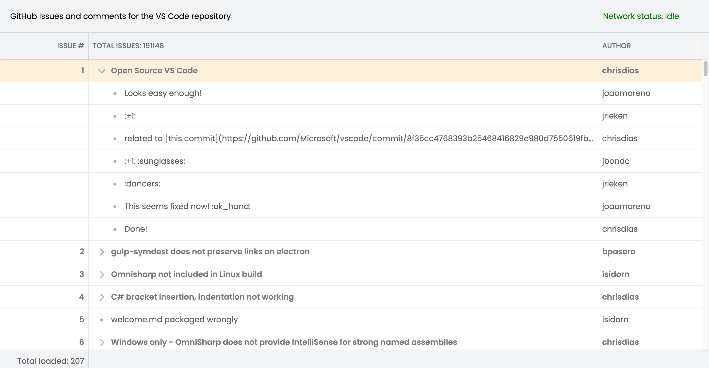

# Using a Bryntum TreeGrid with the GitHub GraphQL API: Lazy loading, on-demand data fetching, and remote filtering

This is a [Next.js](https://nextjs.org) project bootstrapped with [`create-next-app`](https://nextjs.org/docs/app/api-reference/cli/create-next-app).

## Installing the dependencies

First install the dependencies:

```sh
npm install
```

Next, install the Bryntum Grid component by following the instructions to [access the Bryntum npm registry](https://bryntum.com/products/grid/docs/guide/Grid/quick-start/javascript-npm#access-to-npm-registry) and then [install the Grid](https://bryntum.com/products/grid/docs/guide/Grid/quick-start/javascript-npm#install-component).

## GitHub personal access token

Using the GitHub GraphQL API requires a personal access token. To create one, generate a fine-grained personal access token in your [GitHub **Settings** menu](https://github.com/settings/personal-access-tokens). Set the **Repository access** to "Public Repositories (read-only)". Create a `.env` file in the root directory of this repo and add your access token to it:

```
GITHUB_PERSONAL_ACCESS_TOKEN=<your-access-token>
```

## Running the development server

To run the development server, use the following command:

```bash
npm run dev
```

Open [http://localhost:3000](http://localhost:3000). You'll see a Bryntum TreeGrid with issues data from the VS Code GitHub Repository:


